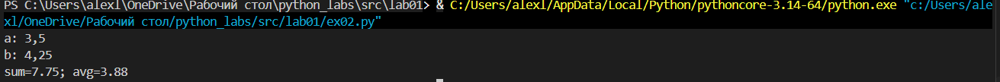
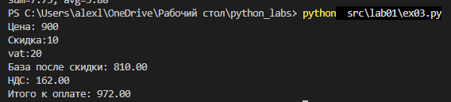
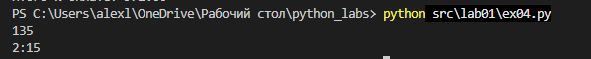
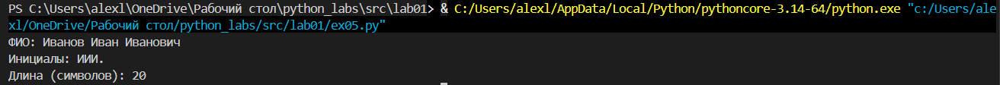
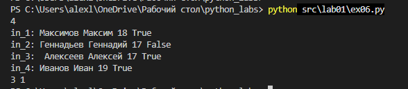
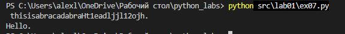

# python_labs 

# Лабораторная работа 2

# Лисёнков Алексей
##
## Задание 1 - arrays.py

Были созданы функции min_max, которая возвращала наибольшее и наименшее значение, unique_sorted, которая возвращает отсортированный список уникальных значений и flatten, которая соединяет в себя кортежи и списки

### Код под min_max:

def min_max(nums: list[float | int]) -> tuple[float | int, float | int]:
    if not nums:
        raise ValueError("список пуст")
    low = float('inf')
    high = float('-inf')
    for numbers in nums:
        if numbers < low:
            low = numbers
        if numbers > high:
            high = numbers
    return (low, high)

### Пример запуска min_max:

.png)

## Задание 2

## Задание 3

## Задание 4

## Задание 5

## Задание 6

## Задание 7

