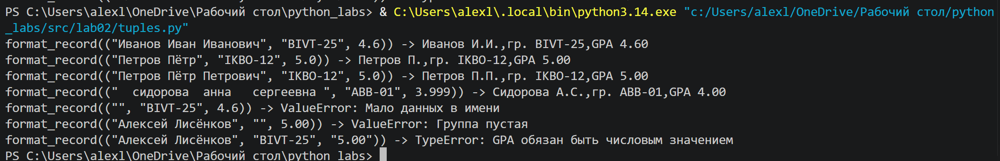

# python_labs 

# Лабораторная работа 2

# Лисёнков Алексей
##
## Задание 1 - arrays.py

Были созданы функции min_max, которая возвращала наибольшее и наименшее значение, unique_sorted, которая возвращает отсортированный список уникальных значений и flatten, которая соединяет в себя кортежи и списки

### Код под min_max:

```python
def min_max(nums: list[float | int]) -> tuple[float | int, float | int]:
    if not nums:
        raise ValueError("список пуст")
    low = float('inf')
    high = float('-inf')
    for numbers in nums:
        if numbers < low:
            low = numbers
        if numbers > high:
            high = numbers
    return (low, high)
```

### Пример запуска min_max:

.png)

### Код под unique_sorted:

```python
def unique_sorted(nums: list[float | int]) -> list[float | int]:
    items = list(set(nums))
    for i in range(1, len(items)):
        key = items[i]
        j = i - 1
        while j >= 0 and items[j] > key:
            items[j + 1] = items[j]
            j -= 1
        items[j + 1] = key
    return items
```

### Пример запуска unique_sorted:

.png)

### Код под flatten:

```python
def flatten(mat: list[list | tuple]) -> list:
    a = []
    for row in mat:
        if type(row) != list and type(row) != tuple:
            raise TypeError("Строка должна быть списком или кортежем")
        for x in row:
            a.append(x)
    return a
```

### Пример запуска flatten:

.png)


## Задание 2 - matrix.py

Реализованы следующие функции:
check_matrix - проверяет что матрица прямоугольная (вспомогательная функция)
transpose - транспонирует матрицу
row_sums - возвращает суммы элементов каждой строки
col_sums - возвращает суммы элементов каждого столбца

Все функции работают с прямоугольными матрицами. Если строки имеют разную длину, вызывается ValueError

### Код под transpose:

```python
def transpose(mat: list[list[float | int]]) -> list[list]:
    check_matrix(mat)
    if len(mat) == 0:
        return []
    
    res = []
    for j in range(len(mat[0])):
        row = []
        for i in range(len(mat)):
            row.append(mat[i][j])
        res.append(row)
    return res
```

### Пример запуска transpose:

.png)


### Код под row_sums:

```python
def row_sums(mat: list[list[float | int]]) -> list[float]:
    check_matrix(mat)
    res = []
    for row in mat:
        s = 0
        for x in row:
            s += x
        res.append(s)
    return res
```

### Пример запуска row_sums:

.png)


### Код под col_sums:

```python
def col_sums(mat: list[list[float | int]]) -> list[float]:
    check_matrix(mat)
    res = []
    for j in range(len(mat[0])):
        s = 0
        for i in range(len(mat)):
            s += mat[i][j]
        res.append(s)
    return res
```

### Пример запуска col_sums:

.png)

## Задание 3 - tuples.py

Реализована работа с записями студентов в виде кортежа

###Часть кода:

```python
def format_record(rec: tuple[str, str, float]) -> str:
        
        if type(rec) != tuple:
                raise TypeError('Запись обязана быть кортежем')
        if len(rec) != 3:
                raise ValueError('Недостаточно данных или перебор')
        
        fio, group, gpa = rec
        parts = fio.split()
        group = group.strip()

        if type(fio)!= str or type(group) != str:
                raise TypeError('ФИО и Группа - не строки')
        if type(gpa) != int and type(gpa) != float:
                raise TypeError('GPA обязан быть числовым значением')
        if gpa < 0 or gpa > 5:
               raise ValueError('GPA не в нужном диапазоне')
        if len(parts) != 2 and len(parts) != 3:
                raise ValueError('Мало данных в имени')
        if group == "":
            raise ValueError("Группа пустая")
        
        surname = parts[0].capitalize()
        inits = ''
        for i in range(1, len(parts)):
               if i > 2:
                      break
               inits += parts[i][0].upper() + '.'
        return(f'{surname} {inits},гр. {group},GPA{gpa: .2f}')
```

### Пример запуска col_sums:

